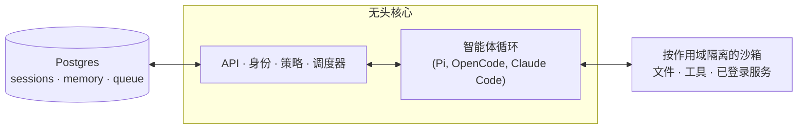

# qm

一个面向工作场景的多智能体协作平台。支持 Slack 与 Web 两种界面。


## QM 是什么？

大多数智能体都被设计成个人助手。你固然可以让一个智能体服务整个公司，但很快会变得复杂。QM 专为创业公司设计：每位员工拥有自己独立的隔离工作区，彼此互不影响地独立工作，同时也可以与智能体在频道、群聊和项目中进行协作。

每个人、每个房间都拥有各自独立作用域的记忆、文件、密钥管理视图、权限、定时任务、Web 应用和持久化沙箱。

QM 以开源为设计理念。你可以自选执行框架（harness）和模型，并在它们之间自由切换——Pi、OpenCode、Codex 和 Claude Code 都能驱动同一个核心，因此部署不会绑定任何单一厂商。

## 特性

- **个人与共享作用域。** 每个人都可以把智能体定制成"自己的"，同时仍能在 Slack 频道和项目中与它协作。
- **Slack 与 Web。** 同一份身份和配置在 Slack 与 Web 应用之间通用。
- **管理员控制。** 设置组织级配置、安全姿态，以及可用哪些执行框架和模型。
- **Web 应用。** 快速搭建内部自定义应用，并发布给合适的人。
- **共享技能。** 技能按作用域归属，可通过授权共享，管理员可将其提升至整个组织，还支持从 Git 仓库导入技能包。
- **后台工作。** 定时任务和监听任务在没有人在场时依然运行。

## 你可以用它做什么

- 同时检索内部笔记、邮件、文档、数据库和 Web
- 从公司知识库中获取信息
- 搭建内部应用，发布给合适的人，并保持数据实时更新
- 从历史发送中学习你的写作风格，然后按计划分类整理收件箱——包括打标签和生成回复草稿
- 在现有代码仓库中工作：运行测试、开 PR、监控 CI、查看系统日志
- 在共享频道中跟进项目，发布更新和后续事项

## 架构



每一轮对话都经过一个中央核心，核心可以使用多种模型和执行框架来生成回复。Postgres 持久化层保存用户数据、会话历史以及其他持久化状态。智能体拥有一个体积小且固定的工具面；其中一个工具是 `execute`，它在作用域自身的隔离沙箱——即它的"持久电脑"——中执行命令，已安装的工具会保持安装状态。Web UI、管理面板和公共门户是可选的插件，构建于核心的 HTTP API 之上；Slack 是一个可选的内存内插件，由核心通过直接的服务客户端启动并监督。

核心直接以 TypeScript 运行在 Node 上，使用 Fastify 提供 HTTP 服务。Slack 插件使用 Bolt；Web UI 使用 Vite 构建、Lit 渲染。

核心本身是通用的。所有针对单一公司的特定内容——组织配置、自定义工具和技能、沙箱镜像、基础设施——都放在一个**部署目录**中，由 [`qm` CLI](./cli/README.md) 校验并部署。每个底层组件（执行框架、会话存储、沙箱、记忆）都位于接口之后，生产实现通过一份接线文件即可替换。

## 安全与机密

QM 的做法与 OpenCode、Codex、Claude Code 等本地编码智能体一致：智能体以它所服务之人的身份行事，使用对方的凭据和权限，并且它的所有行为都会被审计。组织选择一种安全姿态，更小范围的作用域只能在此之上收紧，而不能放宽：

- **严格（Strict）**——每次执行框架工具调用都要暂停等待人工审批，仅两个无副作用的回合结束操作除外。
- **自动（Auto，默认）**——一个分类器在外部数据和工具结果进入模型之前对其进行来源标注的审查；部署可以将审查指向自己的筛查代理。
- **危险（Dangerous）**——不做内容审查，工具调用之间不暂停。

预先声明的命令策略——包括审批规则，以及对递归删除、破坏性 SQL 等操作的硬性拒绝——适用于所有姿态，包括"危险"模式。

[`SECURITY.md`](./SECURITY.md) 说明了威胁模型、运维假设以及已知限制。

## 为你的组织部署

创建一个组织专属的部署仓库，并依赖 `@yc-software/qm`：

```bash
npm exec --yes --package=@yc-software/qm@latest -- \
  qm init . --org <slug> --target <fly-or-aws>
npm install
```

初始化会生成一个供智能体使用的部署技能，并逐步引导完成基础设施、Web 登录、连接器凭据、可选的 Slack 接入、部署和线上验证——无需检出源码。每个部署都运行在运维人员自己的云账户中；初始化不会生成或启用部署 CI，本仓库也没有生产部署工作流。详见 [`deployment.md`](./deployment.md)。

## 本地快速启动（开发环境）

在单机上跑起完整五组件（Core / Auth / Portal / Web UI / Admin）并用邮箱登录，按以下步骤操作。

### 环境要求

- **Node.js ≥ 24**（原生 TypeScript 与 `--env-file-if-exists` 支持）
- **Docker 运行时**（承载 Postgres 与本地沙箱）
- **模型密钥**：例如 Anthropic 兼容端点（`ANTHROPIC_API_KEY` / `ANTHROPIC_AUTH_TOKEN` / `ANTHROPIC_BASE_URL`）

### 1. 安装依赖并构建 Web UI

```bash
npm install
cd plugins/web-ui && npm install && npm run build
```

### 2. 配置 `.env`

根目录 `.env` 的关键项；五个安全密钥用 `openssl rand -hex 32` 生成（`CORE_SIGNING_SECRET` / `CAPABILITY_SECRET` / `PORTAL_IDENTITY_SECRET` / `CONNECTOR_SECRET_KEY` / `SKILL_SIGNING_SECRET`）：

```bash
HARNESS=pi
HARNESS_SECURITY_POSTURE=auto
MODEL_PROVIDER=anthropic
PI_MODEL=<你的模型 ID>
SESSION_STORE=postgres
DATABASE_URL=postgres://postgres@127.0.0.1:5432/qm
ADMIN_GRANTS=<管理员邮箱>:org_admin
CORE_SIGNING_SECRET=…  CAPABILITY_SECRET=…
PORTAL_IDENTITY_SECRET=…  CONNECTOR_SECRET_KEY=…
SKILL_SIGNING_SECRET=…
```

各插件在 `plugins/{web-ui,auth,portal,admin}/.env` 填入对应密钥与 OIDC 配置（Auth broker 作为 IdP，Portal 反向代理并暴露 `/idp`）。

### 3. 启动基础设施

```bash
# Postgres（trust 认证、命名卷持久化、随 Docker 自启）
docker run -d --name qm-auth-postgres \
  -e POSTGRES_DB=qm -e POSTGRES_HOST_AUTH_METHOD=trust \
  -p 5432:5432 --restart unless-stopped \
  -v qm-auth-postgres-data:/var/lib/postgresql/data postgres:16-alpine

# mock 邮件服务（免真实邮箱；验证邮件写入 local/mock-smtp.log）
node local/mock-smtp.mjs
```

### 4. 启动五个服务

| 组件 | 端口 | 启动命令 |
| --- | --- | --- |
| Core | 8080 | `node --env-file-if-exists=.env src/index.ts` |
| Auth broker | 8099 | `node --env-file-if-exists=plugins/auth/.env plugins/auth/src/index.ts` |
| Portal | 8097 | `node --env-file-if-exists=plugins/portal/.env plugins/portal/src/index.ts` |
| Web UI | 8096 | `node --env-file-if-exists=plugins/web-ui/.env plugins/web-ui/server/index.ts` |
| Admin | 8090 | `node --env-file-if-exists=plugins/admin/.env plugins/admin/src/index.ts` |

### 5. 登录（邮箱魔法链接）

浏览器打开 `http://localhost:8097`，在登录页输入管理员邮箱提交。mock 邮件落到 `local/mock-smtp.log`，取出一次性验证链接并打开即可完成登录：

```bash
grep -o 'verify#token=[^ ]*' local/mock-smtp.log | tail -1
```

> 链接只可使用一次、约 15 分钟有效，并且必须在你提交邮箱的**同一个浏览器会话**中打开（OIDC 状态 cookie 与之绑定）。提交后请勿多次重复提交，每次提交都会生成新的状态。

登录后，`ADMIN_GRANTS` 中列出的邮箱自动成为 `org_admin`；管理面板经 Portal 访问 `/admin`，用户、授权、审计与指标均在 Core 中实时鉴权。

### 6. 沙箱镜像（Agent 的 `execute` 能力）

Agent 执行命令依赖本地沙箱镜像，构建一次即可：

```bash
bash scripts/local-sandbox-build.sh
```

产物为 `qm-sandbox-local:latest`（内置 node、claude-code、codex、gh 与 aws cli）。磁盘不足时先清理 `~/Library/Caches`；GitHub 资产受限时可改用镜像站前缀构建（见构建脚本说明）。

## 贡献

我们接受以**人工编写文本**形式而非代码形式的贡献——详见 [`CONTRIBUTING.md`](./CONTRIBUTING.md)。在 [`adrs/`](./adrs/) 目录下用 `.txt` 或 `.md` 文件非正式地描述你想要的变更，如果我们达成一致，会负责实现。漏洞请私下报告——参见 [`SECURITY.md`](./SECURITY.md)，不要在公开 issue 中报告。

## 定制你的实例

上文提到的部署仓库自带配置和沙箱层，永远不需要检出源码。但有些组织想要相反的取舍：把整套代码放在一处，让工程师和编码智能体同时阅读核心与定制内容，而定制内容本身保持私有。为此，请维护一个**私有 fork**：一个独立的私有仓库，其历史始于对 qm 的克隆，核心与上游保持字节级一致。

先填充一次，再克隆进行工作：

```bash
gh repo create <org>/qm-private --private

git clone --bare git@github.com:yc-software/qm qm-seed.git
git -C qm-seed.git push --mirror git@github.com:<org>/qm-private
rm -rf qm-seed.git

git clone git@github.com:<org>/qm-private
git -C qm-private remote add upstream git@github.com:yc-software/qm
```

如上所示，创建私有 fork 请使用普通克隆（plain clone），永远不要使用 GitHub 的 fork 功能。这里的"fork"指的是概念——一个有意识分叉、并从上流合并的下游副本——而不是 GitHub 的 Fork 按钮。GitHub fork 会继承源仓库的可见性，因此公共仓库的 fork 无法设为私有。GitHub fork 还与源仓库共享同一个对象网络，所以推送到 fork 的提交在公共一侧仍可按 SHA 获取。许多组织也禁止对私有仓库进行 fork。普通克隆则完全没有这些问题，它只付出一个代价：克隆是一个普通仓库，因此上游的 CI 工作流会在你自己的账户中运行。请准备这些工作流所需的密钥，或禁用你不想运行的工作流。

组织专属的一切都放在 `deploy/layers/<org>/`——配置、沙箱工具和技能、插件镜像、基础设施——与 `qm init` 产出的结构一致。参见 [`deploy/layers/README.md`](./deploy/layers/README.md)。核心保持与上游字节级一致，这正是让合并保持轻量的原因。

两个技能从两个方向维护这条边界。`update-qm` 将上游 qm 合并进私有 fork 并开启同步 PR；`upstream-pr` 将一份与组织无关的修复发回 qm——它会从 `upstream/main` 切出分支，并在推送前检查待推送的差异、提交信息和截图是否包含组织标识。`deploy/layers/` 下的任何内容都不会被推送到上游。

## 深入了解

- [`docs/getting-started.md`](./docs/getting-started.md)——首次运行，端到端
- [`cli/README.md`](./cli/README.md)——`qm` CLI 与部署目录契约
- [`docs/deploy-directory.md`](./docs/deploy-directory.md)——部署目录完整说明
- [`.env.example`](./.env.example)——所有可配置项，均已就地说明
- [`plugins/`](./plugins)——各界面（Slack、Web UI、管理面板、门户）

## 许可证

除特别注明外，QM 以 [MIT License](./LICENSE) 发布。
